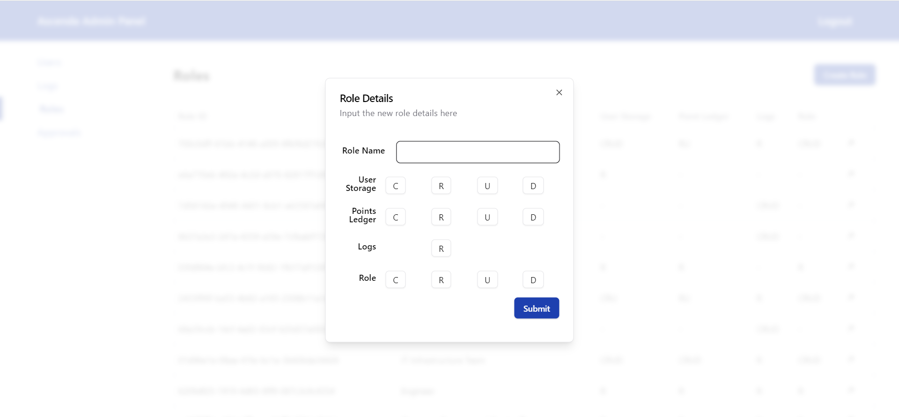
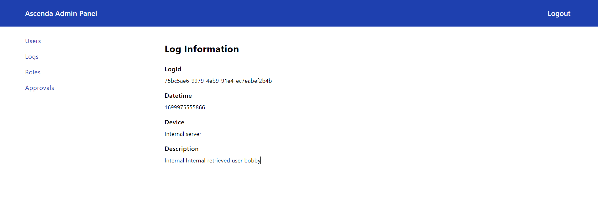
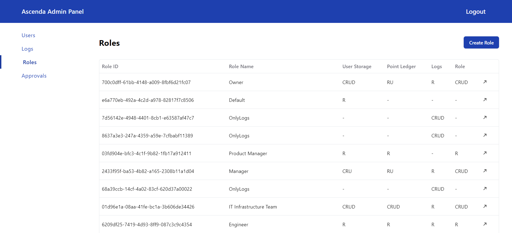
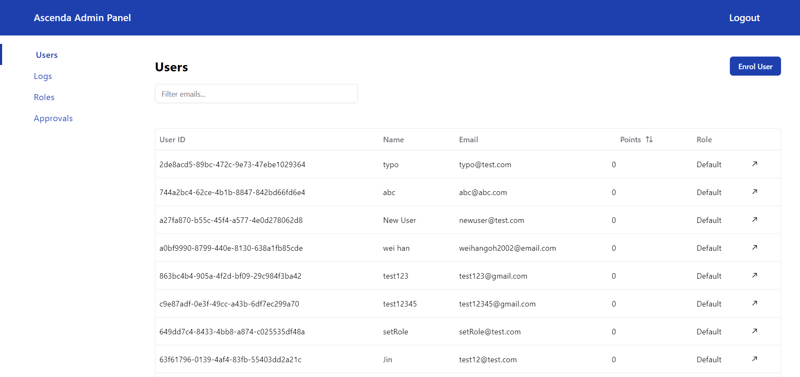
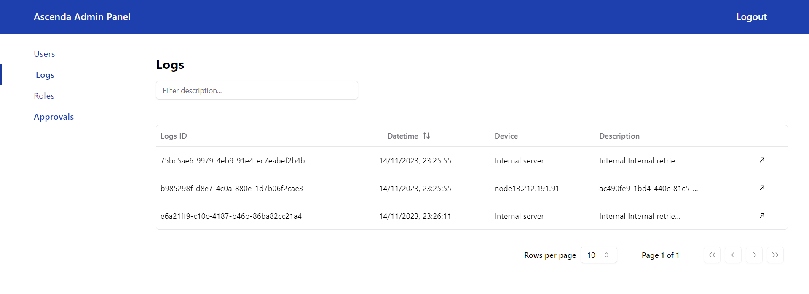
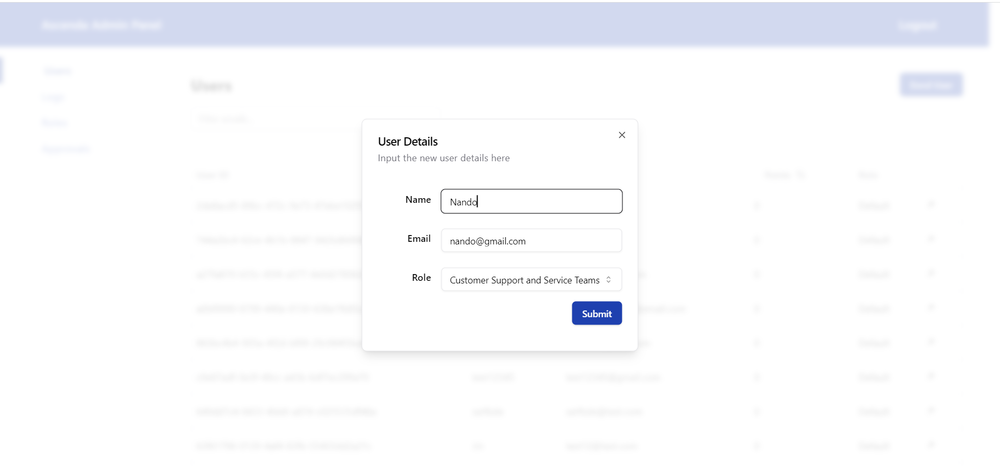
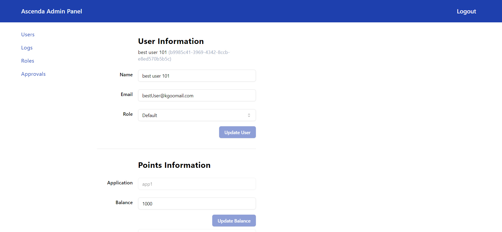

# Admin Panel UI
Built with
- NextJS
- Tailwind
- NextAuth
- Shadcn

## Setup
Install Node 18
 
Install dependencies:
```bash
npm i
```

Get environment secrets from Notion
See .env.example

## Run app
Start development server:

```bash
npm run dev
```

Open [http://localhost:3000](http://localhost:3000) with your browser to see the result.

## Admin UI Images

### Creation of New Role


### Logs Information


### Roles


### Users


## Logs


## New User Details


### User Information

